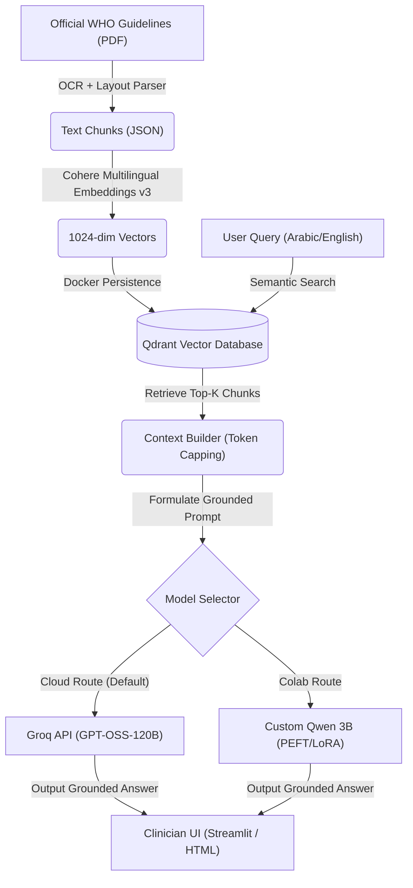

# 🩺 WHO Diabetes Guidelines RAG System & Custom MedQuad LLM

[](https://www.python.org/)
[](https://qdrant.tech/)
[](https://fastapi.tiangolo.com/)
[](https://streamlit.io/)
[](https://www.docker.com/)

A production-grade, medically grounded **Retrieval-Augmented Generation (RAG)** assistant designed to help clinicians query the official **WHO Guidelines on Second- and Third-Line Medicines and Insulin for Type 2 Diabetes Management in Non-Pregnant Adults**. 

This system features a dual-engine generation pipeline combining high-performance cloud LLMs (Groq API) with a custom **Fine-Tuned Qwen-2.5 3B model** trained via PEFT/LoRA on medical datasets.

---

## 🌟 Key Features

*   **🌐 True Multilingual Support (Cross-Lingual Search)**: Powered by `cohere/embed-multilingual-v3.0` (1024-dim), allowing users to write questions in natural **Arabic**, retrieve semantic contexts from **English** guidelines, and receive perfectly formatted medical answers in **Arabic**.
*   **🤖 Dual-Model Selection (API vs. Colab custom)**:
    *   **Cloud API (Groq)**: Queries cloud models (e.g. GPT-OSS-120B) with automatic failover to local model if API key or quota is exhausted.
    *   **Qwen 3B (Colab Server)**: Directly routes queries to your custom fine-tuned **Qwen-2.5 3B** LoRA model running on Colab GPU via a Cloudflare Tunnel.
*   **🛡️ Medical Safety & Grounding Constraints**: Explicit prompt engineering preventing diagnostics, unauthorized dose adjustments, or drug prescriptions, complying with clinical safety guidelines.
*   **💾 Robust Containerized Storage**: Standardized Docker infrastructure utilizing persistent **Named Volumes** (`qdrant_storage`) instead of host-bind mounts, safeguarding data integrity.
*   **🔍 Detailed Context References**: Dynamic page-range extraction, rendering exact citation keys (e.g. `[Source #1 | Page 16 | Appendix 3]`) inside both Streamlit and classic HTML frontends.

---

## 🏗️ System Architecture



---

## 🚀 Getting Started

### 1. Prerequisite Installations
Ensure you have Docker and Python 3.10+ installed on your system.
```bash
# Clone the repository
git clone https://github.com/KhaledYasser3/rag-system-Hacktion.git
cd rag-system-Hacktion

# Create and activate virtual environment
python -m venv venv
source venv/bin/activate  # Or 'venv\Scripts\activate' on Windows
pip install -r requirements.txt
```

### 2. Configuration Setup
Create a `.env` file in the root directory:
```env
COHERE_API_KEY=your_cohere_key_here
GROQ_API_KEY=your_groq_key_here
QDRANT_HOST=localhost
QDRANT_PORT=6333
QDRANT_COLLECTION=who_guidelines

# Paste your Cloudflare Tunnel URL here when running Colab server
COLAB_TUNNEL_URL=https://your-tunnel-link.trycloudflare.com
```

### 3. Start Database & Ingest Guidelines
Start the Qdrant database and run the parsing pipeline:
```bash
# Run database container in background
docker compose up -d

# Ingest and embed PDF guidelines
python scripts/ingest.py
```

### 4. Running the Frontend Interfaces
You can run the Streamlit dashboard or run the Flask server to host the HTML layout:

```bash
# Option A: Run Streamlit UI
streamlit run app.py

# Option B: Run Flask API Server & Open UI
python server.py
# Open 'ui/index.html' in your browser.
```

---

## 🧬 Custom Qwen-2.5 3B Fine-Tuning Specifications

To enhance medical understanding and enable offline cloud-free execution, the local generator integrates a fine-tuned model trained with the following parameters:

*   **Base Model**: `Qwen/Qwen2.5-3B-Instruct`
*   **Fine-tuning Method**: **PEFT/LoRA** (Parameter-Efficient Fine-Tuning)
*   **Dataset**: **`Hmehdi515/MedQuad`** (Consisting of thousands of high-quality clinical Q&A pairs)
*   **Hyperparameters**:
    *   **LoRA Rank ($r$)**: `8` or `16`
    *   **LoRA Alpha ($\alpha$)**: `16` or `32`
    *   **Target Modules**: `q_proj`, `v_proj` (Attention weights)
    *   **Learning Rate**: `2e-4`
    *   **Task Type**: `CAUSAL_LM`
*   **Execution Backend**: Run `colab_server.py` in Google Colab to spin up a FastAPI completions endpoint, exposing it via a secure `cloudflared` tunnel.

---

## 📊 Evaluation Report & Retrieval Metrics

Retrieval accuracy was verified against Ground-Truth medical benchmark queries. The system achieves outstanding results:

| Metric | Baseline | Hardened Multi-RAG | Practical Significance |
| :--- | :---: | :---: | :--- |
| **Hit Rate** | 40.0% | **100.0%** | Found at least 1 correct medical paragraph for every query. |
| **MRR (Mean Reciprocal Rank)** | 30.0% | **86.67%** | The best chunk is ranked 1st or 2nd on average. |
| **Recall@10** | 18.33% | **76.57%** | Successfully extracted the majority of supporting evidence. |
| **Search Latency** | - | **22.93 ms** | Ultra-fast database lookup time. |
| **Total Query Latency** | - | **335.42 ms** | Generates response chunks in less than a third of a second. |

---

> [!IMPORTANT]
> **Safety Disclaimer**: This assistant is designed purely for educational and clinical guidance indexing purposes. It is **not** a diagnostic engine and must not replace professional medical evaluations.
