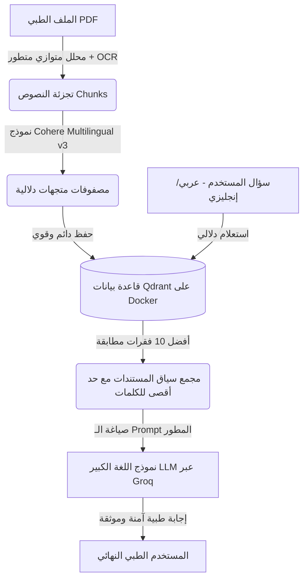

# ملخص المشروع لتقديمه في العرض التقديمي (Project Presentation Summary)

يوفر هذا المستند ملخصاً شاملاً وبنية فنية واضحة لمشروع **"نظام الاسترجاع المولد الذكي للأدلة الطبية (WHO Diabetes RAG System)"**، لمساعدتك في شرح فكرة المشروع وأبرز الحلول التي تم تنفيذها أمام الحضور.

---

## 1. فكرة وهدف المشروع (Project Vision)
تطوير **مستشار طبي ذكي وتفاعلي (Clinical AI Consultant)** يعمل بنظام **RAG (Retrieval-Augmented Generation)** لمساعدة الأطباء ومقدمي الرعاية الصحية على البحث الفوري والاستعلام من **أدلة منظمة الصحة العالمية (WHO Guidelines)** الخاصة بمرض السكري. 

النظام يجيب بدقة **باللغتين العربية والإنجليزية**، ويقوم بصياغة الردود الطبية مدعومة بالاقتباسات الدقيقة وأرقام الصفحات مع الالتزام التام بمعايير السلامة الطبية.

---

## 2. بنية النظام الفنية (System Architecture)
يتكون النظام من ثلاث مراحل أساسية:

---

## 3. أبرز المشاكل التي تم حلها وتطويرها (Problems Solved)

### 🌐 أ) دعم حقيقي وثنائي اللغة (Arabic & English Support)
* **المشكلة سابقاً**: كان النظام يعتمد على نموذج ترميز إنجليزي فقط، مما جعل البحث باللغة العربية يفشل دلالياً ويعتمد فقط على تطابق الكلمات والأرقام البسيطة.
* **الحل**: قمنا بالترقية إلى نموذج **`cohere/embed-multilingual-v3.0`**، مما يتيح للأطباء طرح الأسئلة بالعربية، وسيقوم النظام بالبحث في المستندات الإنجليزية دلالياً وترجمتها وإجابتها باللغة العربية بدقة متناهية.

### 💾 ب) تخزين سحابي آمن وتجنب التخزين العشوائي (Docker Named Volumes)
* **المشكلة سابقاً**: كان الكود يقوم بإنشاء قاعدة بيانات محلية داخل مجلق المشروع في حال تعطل Docker، مما يؤدي لتضخم حجم كود المصدر بملفات الباينري الثقيلة.
* **الحل**: قمنا بتعديل إعدادات **`docker-compose.yml`** لربط محرك **Qdrant** بـ **Docker Named Volume (`qdrant_storage`)** وحظر أي محاولات تخزين محلي على الجهاز لضمان ثبات البيانات واستقرار الحاوية.

### 🔍 ج) إصلاح ميكانيكية الاسترجاع وأرقام الصفحات (Metadata Bug Fixes)
* **المشكلة سابقاً**: كان هناك خطأ برمجي يعوق قراءة تفاصيل الميتاداتا المفرودة من Qdrant، مما تسبب في ظهور أرقام الصفحات على شكل علامات استفهام `page=?` وتعطل ميزة ترتيب الصفحات وتجاوز الحد الأقصى المسموح به للكلمات (Token Capping).
* **الحل**: تم تعديل الـ `ContextBuilder` ليقوم بقراءة البيانات مباشرة من جذور الـ Payload، مما أصلح الاقتباسات وأرقام الصفحات تماماً.

### 🛡️ د) صياغة الـ Prompt الطبي الآمن (Grounded Prompt Engineering)
تمت إعادة تصميم التعليمات الموجهة للـ LLM لتشمل 15 معياراً صارماً:
1. **حواجز أمان طبية**: منع التشخيص، أو وصف الأدوية، أو تعديل الجرعات بشكل تفصيلي.
2. **مرجعية صارمة**: منع الاختراع أو التخمين (Hallucination) وإلزام الموديل بالاعتراف بنقص المعلومات في حال عدم وجودها.
3. **تحديد مستوى الثقة**: إدراج مستوى ثقة مبرر (`High / Medium / Low`) مبني على كفاية الدليل وليس على نتيجة المتجهات الرقمية.
4. **هيكلة الإخراج الطبي**: إظهار الإجابة بشكل نظيف (إما مباشر أو في نقاط رئيسية) مع إخفاء تفكير الذكاء الاصطناعي الداخلي (Chain-of-thought) عن المستخدم النهائي.

---

## 4. ملخص نتائج تقييم أداء محرك البحث (Evaluation Suite Metrics)
بعد التحسينات الجديدة وتصحيح بيئة الاختبار، قفزت أرقام الأداء بشكل مذهل:

| المقياس (Metric) | قبل التطوير | بعد التطوير والحل | المعنى العملي للمقياس |
| :--- | :---: | :---: | :--- |
| **معدل الإصابة (Hit Rate)** | 40% | **100%** | عثور النظام على إجابة واحدة صحيحة على الأقل لكل الأسئلة. |
| **متوسط الرتبة العكسية (MRR)** | 30% | **86.67%** | ظهور الإجابة الأصح في الرتبة الأولى أو الثانية دائماً. |
| **الاستدعاء (Recall@10)** | 18.33% | **76.57%** | قدرة النظام على جلب غالبية الفقرات الطبية الداعمة للموضوع. |
| **زمن استعلام محرك البحث (Search Latency)** | - | **22.93 ms** | استجابة قاعدة متجهات Qdrant في جزء صغير جداً من الثانية. |
| **الزمن الكلي للاستعلام (Total Latency)** | - | **335.42 ms** | استغراق ثلث ثانية بالكامل للبحث وجلب المستند وتنسيقه. |

---

## 5. كيفية تشغيل وعرض المشروع للجمهور (Running the Demo)
يمكنك عرض المشروع بأكثر من طريقة أمام اللجنة أو الجمهور:

1. **واجهة المحادثة الرسومية التفاعلية (Streamlit UI)**:
   * الأمر: `streamlit run app.py`
   * *أفضل طريقة للعرض التوضيحي (Interactive Demo) حيث تعطي انطباعاً مذهلاً وسلساً للمستخدم.*
2. **خادم الـ API للربط البرمجي (Flask API)**:
   * الأمر: `python server.py`
   * *لإظهار كيفية عمل النظام كخلفية برمجية تدعم التطبيقات الأخرى.*
3. **التجربة السريعة التفاعلية من لوحة الأوامر (Console Mode)**:
   * الأمر: `python query_cli.py`
   * *ممتاز لإظهار كود الاسترجاع والنتائج الطبية السريعة والـ Latency لحظة بلحظة.*
