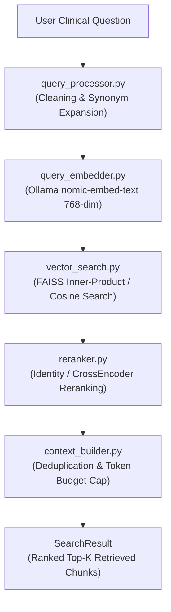

# 🏥 Stage 5: Production-Grade Medical RAG Retrieval Framework

A modular, highly scalable, and production-grade Retrieval Framework built for the **WHO Diabetes Guidelines Medical RAG Assistant**.

This stage takes pre-embedded document chunks from Stage 4 (`embeddings.json`), indexes them into a vector store (**FAISS**), performs similarity searches for user clinical questions, reranks candidates, and constructs token-budget-capped context windows.

> [!IMPORTANT]
> **No LLM Generation**: This module is strictly responsible for retrieval, ranking, and context assembly. It does **not** call LLMs or generate answers.

---

## 📁 System Architecture & Directory Structure

```text
stage_5_retriever/
├── config.py              # Centralized configuration & hyperparameters
├── models.py              # Dataclasses (Query, RetrievedChunk, SearchResult, EvaluationMetrics)
├── query_processor.py     # Query cleaning, normalization & medical synonym expansion
├── query_embedder.py      # Ollama nomic-embed-text 768-dim query embedding generator
├── vector_store.py        # FAISS vector database store & index management
├── vector_search.py       # Similarity search engine over FAISS
├── reranker.py            # Abstract Reranker interface + IdentityReranker & CrossEncoder hooks
├── context_builder.py     # Deduplication, relevance/page sorting & token budget capping
├── retriever.py           # Pipeline orchestrator
├── metrics.py             # Pure mathematical IR metrics (Recall@K, Precision@K, MRR, Hit Rate, nDCG)
├── evaluator.py           # Benchmark evaluator and report printer
├── test_retriever.py      # Clinical benchmark test suite & validation script
└── README.md              # Technical documentation & usage guide
```

---

## 🔄 Pipeline Execution Flow



---

## 🚀 Quick Start & Testing

To run the retrieval evaluation suite:

```bash
python stage_5_retriever/test_retriever.py
```

### Python API Usage Example

```python
from stage_5_retriever.config import RetrieverConfig
from stage_5_retriever.retriever import MedicalRetriever

# 1. Initialize retriever
config = RetrieverConfig(top_k_final=5, similarity_threshold=0.30)
retriever = MedicalRetriever(cfg=config)

# 2. Retrieve top chunks for a question
question = "What is the recommended second-line treatment for type 2 diabetes?"
result = retriever.retrieve(question)

# 3. Inspect retrieved chunks
for chunk in result.chunks:
    print(f"Rank {chunk.rank} | Score: {chunk.score:.4f} | ID: {chunk.chunk_id}")
    print(f"Chapter: {chunk.chapter} | Section: {chunk.section}")
    print(f"Content: {chunk.content[:150]}...\n")
```

---

## 🛠️ Extensibility & SOLID Design

1. **Replacing Vector Database**:
   - `vector_store.py` implements `BaseVectorStore`. To switch to **ChromaDB**, **Qdrant**, or **Milvus**, simply implement a new subclass of `BaseVectorStore`. No changes to `retriever.py` are required.

2. **Upgrading Reranker**:
   - `reranker.py` implements `BaseReranker`. To plug in a deep learning **CrossEncoder** or **BGE Reranker**, instantiate `CrossEncoderReranker(model_name="BAAI/bge-reranker-large")`.

3. **Custom Medical Synonym Expansion**:
   - `query_processor.py` defines `SynonymExpander`. Custom medical ontologies (UMLS, SNOMED-CT, RxNorm) can be plugged in seamlessly.
